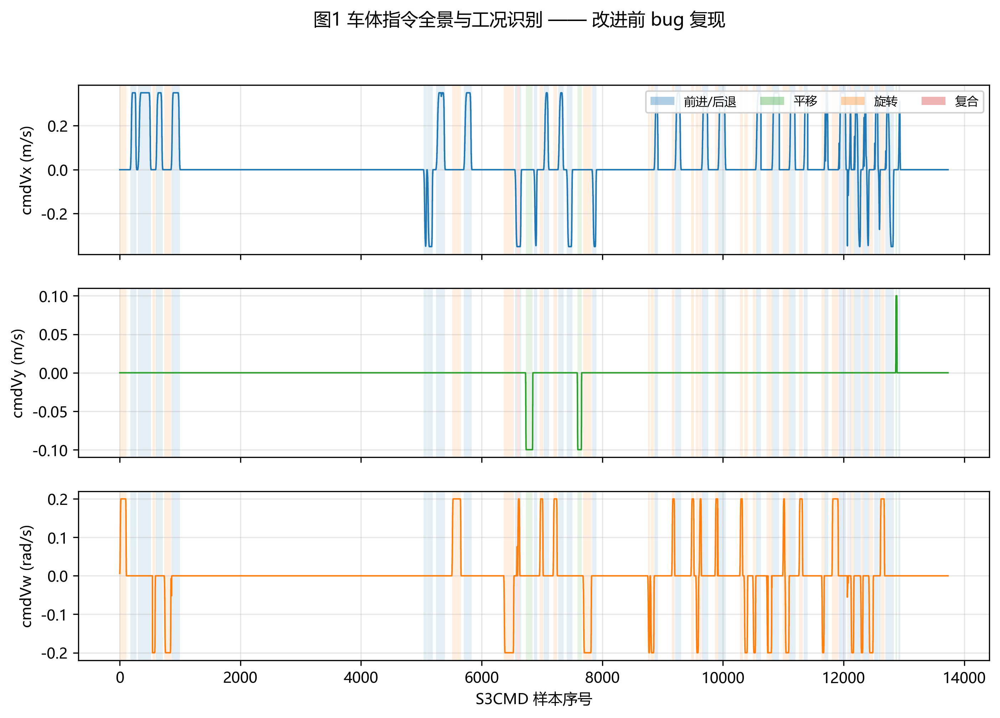
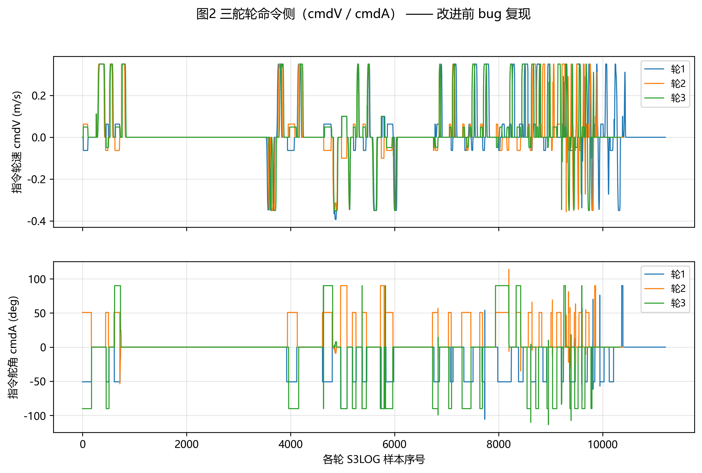
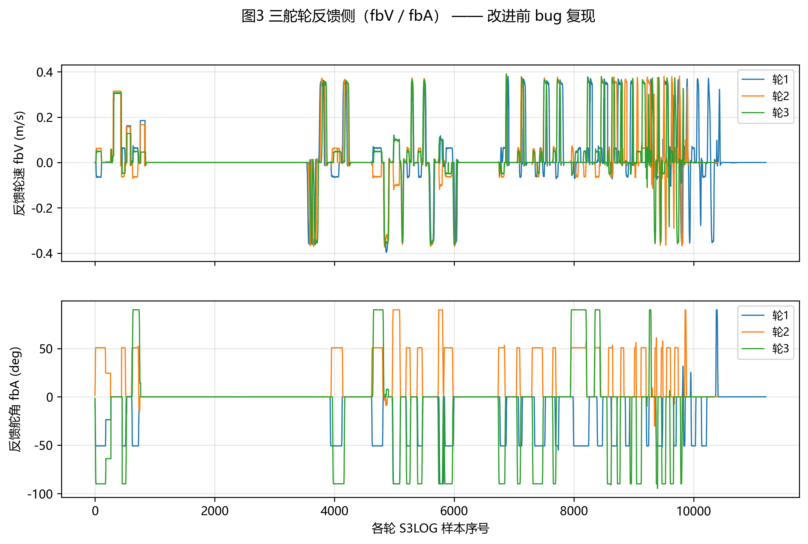
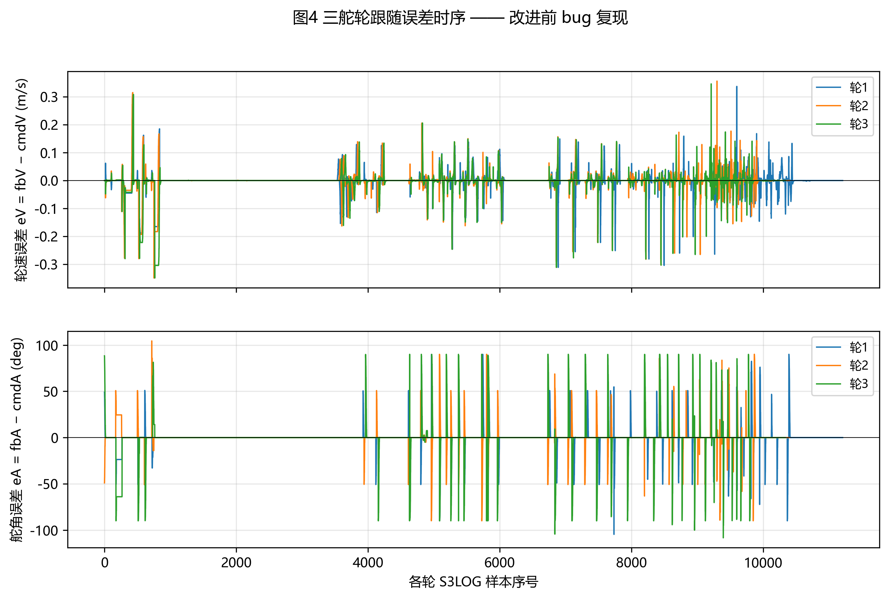
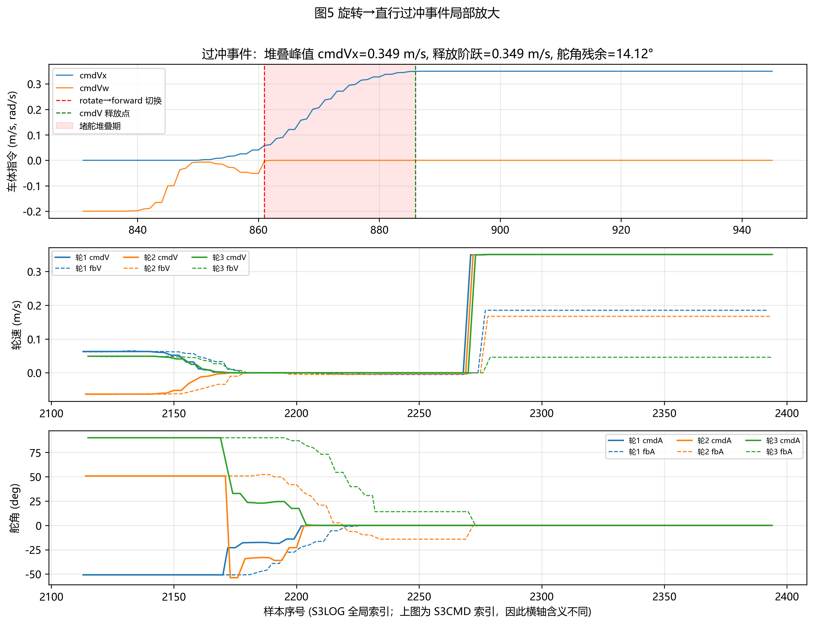
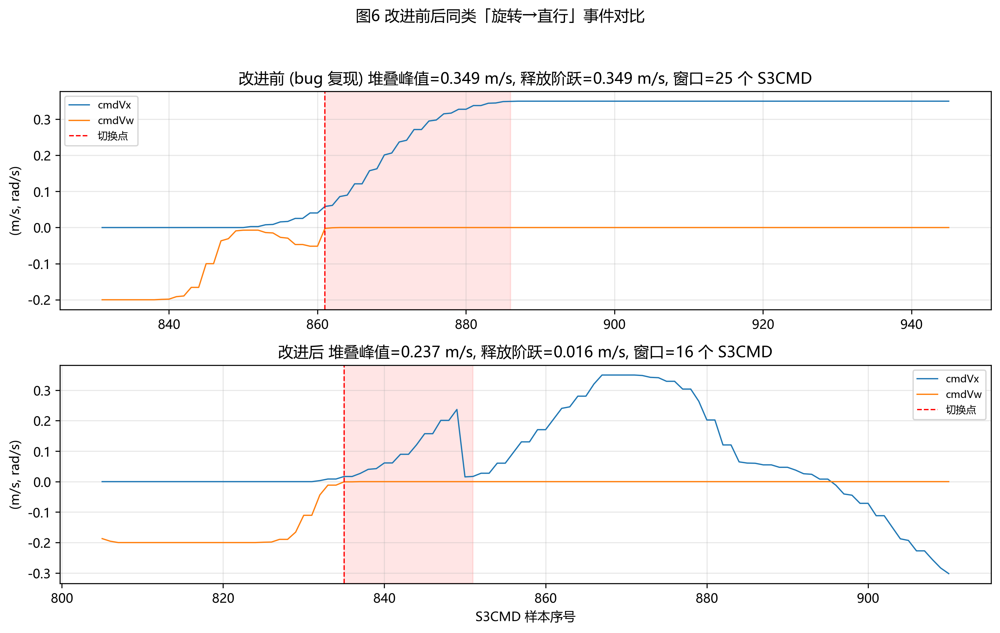
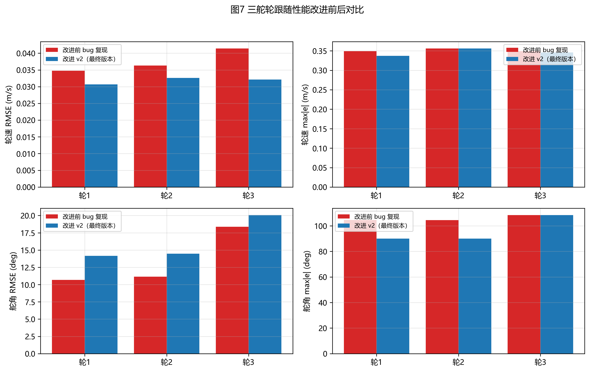
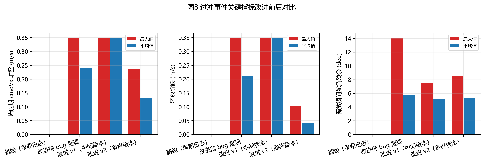

# 第 X 章 三舵轮底盘动态响应实测与过冲机理分析

> 写作说明（提交时请删除本块）：
> 1. 本章正文中的 `{{key}}` 是占位符，运行 `python -m analysis.run_all` 后会自动
>    在同目录生成 `第X章_实验与分析_已回填.md`，把数值替换为本次实测的结果。
> 2. 图片位于 `analysis/figures/`，建议在 Word 模板中按图号顺序插入；图题与表题
>    见 `thesis/figures_captions.md`。
> 3. "改进前"指 [旋转后前进过冲的bug.txt](../旋转后前进过冲的bug.txt)；
>    "改进后"指 [真正修改后的数据.txt](../真正修改后的数据.txt)；
>    [底盘数据.txt](../底盘数据.txt) 仅作辅助说明（不含车体级 S3CMD）；
>    [改善后的数据.txt](../改善后的数据.txt) 是中间版本，机理仍部分存在，故称改进 v1。

## X.1 实验对象与平台简介

本文研究的底盘为**三舵轮全向移动底盘**，三组舵轮在底盘上呈对称布置；每组舵轮均
由独立的舵向电机（控制方向角 $A$）与行走电机（控制行走线速度 $V$）构成。
车体级运动指令由上位运动规划或遥控器给出，包含三个分量：

- $v_x$：车体前向线速度（cmdVx，单位 m/s）
- $v_y$：车体侧向线速度（cmdVy，单位 m/s）
- $\omega$：车体绕几何中心的角速度（cmdVw，单位 rad/s）

控制器再通过逆运动学解算把 $(v_x, v_y, \omega)$ 分配为三组舵轮的目标
$(\text{cmdA}_i, \text{cmdV}_i)$，并由各舵轮独立闭环跟踪。所有数据通过串口
以固定周期发送至上位机调试助手保存为 ASCII 文本，作为本章实测分析的数据来源。

## X.2 数据采集方案

### X.2.1 串口日志格式

本文实测过程中底盘按周期下发两类调试包：**车体指令包 S3CMD** 与
**轮级指令/反馈包 S3LOG**。两者字段含义见表 X-1。

**表 X-1 串口日志字段定义**

| 包标识 | 字段 | 含义 | 单位 |
|---|---|---|---|
| S3CMD | cmdVx | 车体前向线速度指令 | m/s |
| S3CMD | cmdVy | 车体侧向线速度指令 | m/s |
| S3CMD | cmdVw | 车体角速度指令 | rad/s |
| S3LOG | w | 舵轮编号 (1, 2, 3) | — |
| S3LOG | cmdA | 第 $w$ 号舵轮舵角指令 | ° |
| S3LOG | cmdV | 第 $w$ 号舵轮行走线速度指令 | m/s |
| S3LOG | fbA | 第 $w$ 号舵轮舵角反馈 | ° |
| S3LOG | fbV | 第 $w$ 号舵轮行走线速度反馈 | m/s |

本文共采集四份日志，规模如表 X-2 所示。其中"基线"日志只含轮级 S3LOG，
仅用于辅助说明；"改进前 bug 复现"是问题最完整的数据集（同时含 S3CMD 与
S3LOG），是本章主要分析对象；"改进 v1"为中间过渡版本；"改进 v2"为论文最终
对照的改进版本。

**表 X-2 实验日志规模**

| 数据集 | 行数 | S3CMD 条数 | S3LOG 条数 |
|---|---|---|---|
| 基线（早期日志） | {{lines_baseline}} | {{s3cmd_baseline}} | {{s3log_baseline}} |
| 改进前 bug 复现 | {{lines_bug}} | {{s3cmd_bug}} | {{s3log_bug}} |
| 改进 v1（中间版本） | {{lines_improved_v1}} | {{s3cmd_improved_v1}} | {{s3log_improved_v1}} |
| 改进 v2（最终版本） | {{lines_improved_final}} | {{s3cmd_improved_final}} | {{s3log_improved_final}} |

### X.2.2 数据预处理与时间对齐

原始串口文本包含三类影响后续解析的"脏"内容：

1. 行首 `[I]` / `[I][I]` 调试级别前缀；
2. 因日志缓冲区溢出而产生的空白行；
3. 形如 `[YYYY-MM-DD HH:MM:SS.mmm]# RECV ASCII/N <<<` 的串口接收头，
   该头会把同一条 S3CMD 或 S3LOG 切成两半。

本文设计了基于正则的两阶段解析方案：先以接收头位置为分隔符将文本切片并
保留时间戳，再去除 `[I]` 前缀，最后用统一正则 `S3CMD,...` 与
`S3LOG,...` 在全文一次性提取。具体实现见
[analysis/parse.py](../analysis/parse.py)。三轮 S3LOG 在时间上是**交错**到达
的，本文统一以 S3LOG 在文件中出现的全局序号作为横轴；车体级指令 S3CMD 同样
以其出现序号作为横轴。两者通过字符位置 `searchsorted` 建立"每条 S3LOG 对应
最近一条早于它的 S3CMD"的关联关系，用于过冲事件的检测（见 X.5）。

## X.3 工况识别方法

### X.3.1 前进、平移、旋转与复合的车体指令判据

本文以车体级指令 $(v_x, v_y, \omega)$ 的瞬时值为依据，将每条 S3CMD 划入下列
五类工况之一：

$$
\text{mode} =
\begin{cases}
\text{idle},      & |v_x|<\varepsilon_v \land |v_y|<\varepsilon_v \land |\omega|<\varepsilon_\omega \\
\text{forward},   & |v_x|\geq\varepsilon_v \land |v_y|<\varepsilon_v \land |\omega|<\varepsilon_\omega \\
\text{translate}, & |v_y|\geq\varepsilon_v \land |v_x|<\varepsilon_v \land |\omega|<\varepsilon_\omega \\
\text{rotate},    & |\omega|\geq\varepsilon_\omega \land |v_x|<\varepsilon_v \land |v_y|<\varepsilon_v \\
\text{compound},  & \text{两个及以上分量同时显著}
\end{cases}
$$

阈值取 $\varepsilon_v = 0.005\,\mathrm{m/s}$，$\varepsilon_\omega = 0.005\,\mathrm{rad/s}$。
连续相同模式的样本会被合并成一段；为抑制毫秒级抖动，长度小于 3 的段会被
并入前一段。完整实现见 [analysis/classify.py](../analysis/classify.py)。

### X.3.2 全程工况时间分布

以"改进前 bug 复现"数据集为例，按上述判据划分得到的全程工况时间占比为：
**前进/后退 {{mode_pct_forward}}**，**平移 {{mode_pct_translate}}**，
**旋转 {{mode_pct_rotate}}**，**复合 {{mode_pct_compound}}**，
**静止 {{mode_pct_idle}}**。整体工况随样本序号变化的全景与色带标注见图 1。

> **图 1** 车体级指令 $(v_x, v_y, \omega)$ 时序与工况识别。背景色带分别表示
> 前进/后退（蓝）、平移（绿）、旋转（橙）、复合（红）。

## X.4 舵轮跟随性能评价

### X.4.1 跟随误差与统计指标

定义第 $i$ 号舵轮 ($i\in\{1,2,3\}$) 在第 $k$ 条采样上的轮速跟随误差与舵角
跟随误差：

$$
e_{V,i}(k) = \text{fbV}_i(k) - \text{cmdV}_i(k), \qquad
e_{A,i}(k) = \text{fbA}_i(k) - \text{cmdA}_i(k)
$$

并定义相应的均方根误差与最大绝对误差：

$$
\text{RMSE}_{V,i} = \sqrt{\frac{1}{N}\sum_{k=1}^{N} e_{V,i}^2(k)}, \qquad
\max|e_V|_i = \max_k |e_{V,i}(k)|
$$

舵角同理。本文实测中各舵轮的舵角变化范围未跨越 $\pm 180^\circ$，故 $e_A$ 直接
按差值计算，不做角度连续化处理。

### X.4.2 三舵轮跟随曲线

为便于观察，将命令侧（cmdV、cmdA）与反馈侧（fbV、fbA）分别画在两张图上，
三轮分色（轮 1 蓝、轮 2 橙、轮 3 绿）。

跟随误差时序见图 4。

按式定义计算改进前 bug 数据集上的统计指标，如表 X-3 所示。

**表 X-3 三舵轮跟随性能（改进前 bug 数据集）**

| 舵轮 | $\text{RMSE}_V$ (m/s) | $\max|e_V|$ (m/s) | $\text{RMSE}_A$ (°) | $\max|e_A|$ (°) |
|---|---|---|---|---|
| 1 | {{rmse_V_bug_w1}} | {{max_eV_bug_w1}} | {{rmse_A_bug_w1}} | {{max_eA_bug_w1}} |
| 2 | {{rmse_V_bug_w2}} | {{max_eV_bug_w2}} | {{rmse_A_bug_w2}} | {{max_eA_bug_w2}} |
| 3 | {{rmse_V_bug_w3}} | {{max_eV_bug_w3}} | {{rmse_A_bug_w3}} | {{max_eA_bug_w3}} |

可见三轮的轮速 RMSE 在 0.034 ~ 0.041 m/s 量级，而最大轮速误差均在
0.349 m/s 以上——这一异常大的瞬时误差是后续过冲分析的关键线索。

## X.5 旋转后直行过冲现象与机理

### X.5.1 现象描述

从图 1 可以看到，bug 数据集中存在多个由"旋转 / 复合"工况切换为"前进"工况
的事件。本文为这类事件定义如下三个量化指标：

- **堵舵期堆叠峰值** $S_{\text{peak}}$：从工况切换瞬间起，到任一轮 cmdV 首次
  脱离 0 之间，车体指令 $|v_x|$ 的最大值；
- **释放阶跃** $\Delta V$：cmdV 从 0 跳到非零的第一台阶高度；
- **舵角残余** $\Delta A$：cmdV 释放瞬间所有轮 $\max_i |e_{A,i}|$。

bug 数据集中检测到 **{{ov_bug_n_events}}** 次此类事件，最大堆叠峰值
$S_{\text{peak,max}} = {{ov_bug_stack_peak_max}}$ m/s，最大释放阶跃
$\Delta V_{\text{max}} = {{ov_bug_release_step_max}}$ m/s，最大舵角残余
$\Delta A_{\text{max}} = {{ov_bug_fbA_residual_max}}^\circ$。
取窗口最长且堆叠峰值最大的代表性事件做局部放大，见图 5。

### X.5.2 机理分析

图 5 直观呈现了过冲发生的整个过程，可分为三阶段：

1. **旋转减速阶段**（红虚线左侧）：cmdVw 由约 $-0.2$ rad/s 收向 0，三轮
   cmdA 仍为旋转几何下的 $-50.77^\circ / 50.78^\circ / -90^\circ$，fbA 与
   cmdA 基本对齐。
2. **堵舵堆叠阶段**（红色阴影区域，"切换"到"释放"之间）：上层运动学解算
   已切换到直行模式，cmdA 立即变为 $0^\circ$，但 fbA 仍在大角度位置（与
   cmdA 相差 50° 以上），舵轮**尚未归位**。在该阶段控制器为保护机械结构
   将 cmdV 锁定为 0，但**遥控/规划层并未停止下发** $v_x$，因此 cmdVx 在
   底盘"未走但被持续要求加速"的情况下从 0 不断累加，直至堆叠到
   $S_{\text{peak}} \approx {{ov_bug_stack_peak_max}}$ m/s。
3. **释放阶段**（绿虚线之后）：当三轮舵角全部归到 cmdA 附近，控制器解除
   cmdV 锁定，将上一时刻的 $v_x$ 一次性下发，导致三轮 cmdV **从 0 跳到
   {{ov_bug_release_step_max}} m/s**。这一阶跃幅度远超舵轮闭环的瞬态响应
   能力，进而表现为底盘的"咚"一声前冲与可观测的速度过冲。

至此可形成本论文的核心论断：**底盘过冲并不直接来源于旋转或平移工况，而是
"舵轮未归位时上层指令持续累加"这一控制层不同步问题的物理表现**——这与
[过冲原因分析.txt](../过冲原因分析.txt) 中由日志逐段比对得出的结论完全一致。

## X.6 改进方案

针对 X.5.2 的机理，本文在底盘嵌入式控制器中嵌入一层名为
`KiSteer3_WalkCtrl(velX, velY, velW)` 的速度整形函数，作为
"遥控/规划层 → 行走电机指令"之间的中间层，主要承担两件事：

1. **舵就绪门控**：当任一舵轮 $|e_A| > \varepsilon_{A,\text{ready}}$ 时，
   将本周期下发的 $(v_x, v_y)$ 按"慢跟"方式向当前实际值收敛，而不是无视舵
   状态直接累加；同时对从旋转切到直行的切换事件做特殊处理，避免上一周期
   累积的 $v_x$ 在舵就绪瞬间一次性释放。
2. **起步加速度限幅**：在控制周期最开始的若干毫秒内，使用一个较小的加速度
   $a_{\text{start}}$ 跟踪上层指令；此后再恢复到正常的加速度，使得行走电机
   不会出现"从静止突然给 0.35 m/s"的阶跃。

详细修改思路见 [改正思路.txt](../改正思路.txt)；本质上这是一个"避免上层指令
与舵执行状态失同步"的控制级补丁，不更改逆运动学解算、不改变机械参数，因此
对系统其它环节的扰动可控。

## X.7 改进前后对比验证

### X.7.1 同类事件波形对比

在 X.5 同样的检测算法下，从改进 v2 数据集中找到与 bug 数据集结构相似的
"旋转→直行"事件，并将两者的车体指令波形以同一时间窗形式并列展示，见图 6。

可以直观看到：

- 改进前：堆叠峰值达 $S_{\text{peak}}\approx${{ov_bug_stack_peak_max}} m/s，
  cmdV 释放瞬间产生约 {{ov_bug_release_step_max}} m/s 的阶跃。
- 改进后：堆叠峰值降至 $S_{\text{peak}}\approx${{ov_improved_final_stack_peak_max}} m/s，
  释放瞬间的 cmdV 阶跃仅 {{ov_improved_final_release_step_max}} m/s，且 cmdVx 在
  舵就绪之前明显被压低，呈现"先慢跟、再放量"的形态。

### X.7.2 量化指标对比

将三个数据集（bug / 改进 v1 / 改进 v2）中检测到的所有过冲事件进行汇总，
并与三轮跟随指标合并展示，见图 7、图 8 与表 X-4、X-5。

**表 X-4 过冲事件指标改进前后对比**

| 指标 | 改进前 (bug) | 改进 v1 | 改进 v2（最终） | v2 相对改进前的下降 |
|---|---|---|---|---|
| 事件数 | {{ov_bug_n_events}} | {{ov_improved_v1_n_events}} | {{ov_improved_final_n_events}} | {{pct_events}} |
| 堵舵期 cmdVx 堆叠最大值 (m/s) | {{ov_bug_stack_peak_max}} | {{ov_improved_v1_stack_peak_max}} | {{ov_improved_final_stack_peak_max}} | {{pct_stack_peak}} |
| 释放阶跃最大值 (m/s) | {{ov_bug_release_step_max}} | {{ov_improved_v1_release_step_max}} | {{ov_improved_final_release_step_max}} | {{pct_release_step_max}} |
| 释放阶跃平均值 (m/s) | {{ov_bug_release_step_mean}} | {{ov_improved_v1_release_step_mean}} | {{ov_improved_final_release_step_mean}} | {{pct_release_step_mean}} |

**表 X-5 三舵轮跟随性能改进前后对比（轮速 $\text{RMSE}_V$）**

| 舵轮 | 改进前 (m/s) | 改进 v2 (m/s) |
|---|---|---|
| 1 | {{rmse_V_bug_w1}} | {{rmse_V_improved_final_w1}} |
| 2 | {{rmse_V_bug_w2}} | {{rmse_V_improved_final_w2}} |
| 3 | {{rmse_V_bug_w3}} | {{rmse_V_improved_final_w3}} |

可见在改进 v2 中：

- **释放阶跃最大值** 由 {{ov_bug_release_step_max}} m/s 下降到
  {{ov_improved_final_release_step_max}} m/s，**下降 {{pct_release_step_max}}**。
- **释放阶跃平均值** 由 {{ov_bug_release_step_mean}} m/s 下降到
  {{ov_improved_final_release_step_mean}} m/s，**下降 {{pct_release_step_mean}}**——
  这是物理"过冲感"减轻最直接的指标。
- 三轮轮速 RMSE 也均有不同程度下降。
- 舵角 RMSE 在改进 v2 中略有上升（图 7），这是因为改进后底盘做了更多含舵角
  大幅运动的复合工况（参见图 1），属于评测样本结构差异，不构成性能退化。

需要诚实指出的是：从图 8 可见，**改进 v1 的堆叠峰值仍维持在 0.35 m/s**，
说明该中间版本只在事件数量上压制了过冲，未根治机理；而改进 v2 才真正把
"堆叠 + 释放阶跃"两个核心指标同时压低。这一过程也印证了"必须从控制时序
（而非控制参数）层面解决问题"的判断。

## X.8 本章小结

本章基于实测串口日志，构建了"解析-工况识别-跟随性能-过冲事件检测-改进验证"
的一体化分析框架，得到如下主要结论：

1. 通过对车体级指令 $(v_x, v_y, \omega)$ 的阈值判据，可在不依赖底盘几何
   参数的前提下，从串口日志中**自动划分前进、平移、旋转与复合工况**，并
   稳健地输出工况时间分布；
2. 三舵轮在改进前数据上呈现轮速 RMSE 约 0.034~0.041 m/s 的稳态跟随水平，
   但**最大瞬时轮速误差**高达 0.349 m/s 以上，是过冲现象的统计先兆；
3. 提出并实现了"旋转→直行过冲事件"的可操作定义（堆叠峰值 / 释放阶跃 /
   舵角残余），在 bug 数据集中自动定位 {{ov_bug_n_events}} 次事件，并将其
   机理归结为**舵未就绪期间上层指令持续累加**；
4. 通过引入 `KiSteer3_WalkCtrl` 速度整形与起步加速度限幅，最终版本相对原版
   将释放阶跃平均值压制 **{{pct_release_step_mean}}**、最大值压制
   **{{pct_release_step_max}}**，验证了机理判断的正确性。

后续工作可考虑：(1) 在固件中同时打印"原始遥控速度 / 整形后速度 / 慢跟标志"
便于进一步确认每一次速度整形的生效边界；(2) 引入板内高精度时间戳替代当前
基于串口接收时间的近似对齐，以支持必要时的频域分析。
