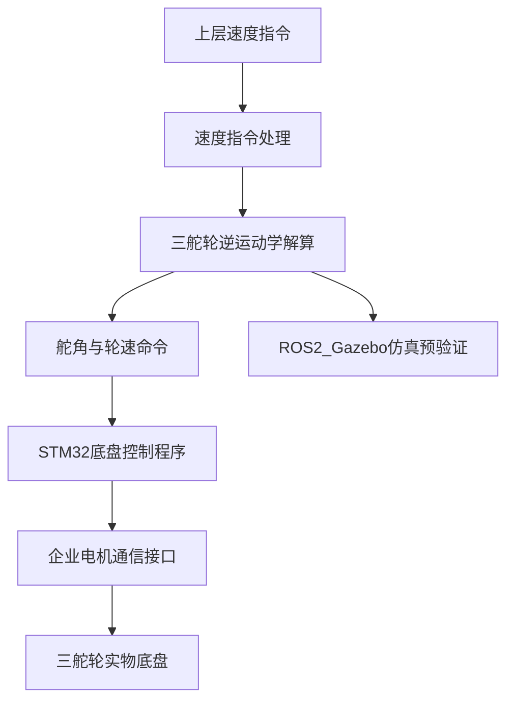
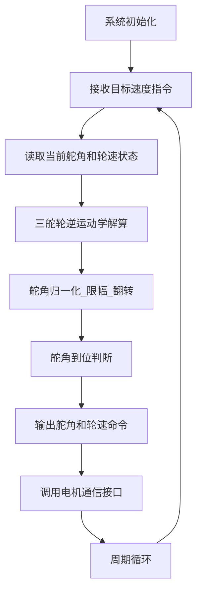

# 基于 STM32 与 ROS 2 的三舵轮移动底盘控制系统设计与验证

> 本文档是毕业设计论文写作稿，可在此基础上继续补充学校封面、摘要、参考文献、实物照片、实验截图和最终数据。  
> 代码来源：`/home/hzx/rccbase2`、`/home/hzx/three_steer_simulation`。

## 0. 论文题目与主线

推荐题目：**基于 STM32 与 ROS 2 的三舵轮移动底盘控制系统设计与验证**。

本文研究对象为三舵轮移动底盘。课题以企业提供的实物底盘和电机通信接口为基础，重点完成基于 STM32 的底盘层控制代码设计，并利用 ROS 2/Gazebo 仿真平台对三舵轮运动学和控制指令输出进行预验证，最后通过实物前进、横移、自转等基础运动工况验证控制逻辑的可行性。

论文写作边界应明确：企业提供底层电机通信接口和实物平台，本课题重点在底盘层速度指令处理、三舵轮运动学解算、舵角与轮速命令生成、仿真验证和实物测试分析。

## 1. 摘要写法

### 中文摘要草稿

三舵轮移动底盘具有全向运动能力，能够在狭窄空间内实现前进、横移和原地旋转等运动形式，适用于移动机器人、仓储搬运和工业巡检等应用场景。针对三舵轮底盘实物调试成本高、控制逻辑验证不便的问题，本文设计了一种基于 STM32 与 ROS 2 仿真平台的三舵轮移动底盘控制系统。

首先，根据三舵轮底盘的结构特点建立车体坐标系，推导由车体速度到各舵轮转角和驱动轮速度的逆运动学关系。其次，基于 STM32F407 控制平台和 FreeRTOS 实时操作系统，完成底盘控制软件架构设计，包括速度指令处理、运动学解算、舵角限幅与翻转处理、轮速命令生成以及电机接口调用等模块。然后，利用 ROS 2、Gazebo 和 ros2_control 搭建三舵轮底盘仿真平台，实现 `/cmd_vel` 速度指令到三组舵角和轮速控制命令的转换，并通过 rosbag 记录典型工况下的控制数据。最后，选取前进、横移和自转三类工况开展仿真与实物实验，对控制命令输出和底盘运动现象进行分析。

实验结果表明，所设计的底盘控制逻辑能够根据目标速度生成合理的舵角和轮速命令，仿真平台能够在实物测试前对运动学解算结果进行有效预验证，实物底盘能够完成基础运动功能。本文工作为三舵轮移动底盘后续的轨迹跟踪、闭环控制和仿真到实物一致性优化提供了基础。

关键词：三舵轮底盘；STM32；FreeRTOS；ROS 2；Gazebo；运动学建模

## 2. 第 1 章 绪论

### 1.1 研究背景与意义

移动机器人底盘是机器人完成自主移动任务的基础执行平台。传统差速底盘结构简单、控制方便，但在横向移动和狭窄空间转向方面存在限制。三舵轮底盘由三个可独立转向和驱动的舵轮组成，能够通过调整各舵轮的转角和轮速实现前进、横移、斜向移动以及原地旋转，具有较好的全向运动能力。

在企业实际项目中，三舵轮底盘需要同时满足运动灵活性、控制实时性和实物运行可靠性的要求。由于实物调试过程涉及电机、机械结构、通信接口、安全保护和供电等多个因素，直接在实物上验证控制逻辑存在一定风险。因此，先建立运动学模型和仿真验证平台，再迁移到 STM32 实物控制系统，是一种较稳妥的开发方式。

本文围绕三舵轮移动底盘开展研究，完成底盘运动学建模、STM32 控制代码设计、ROS 2/Gazebo 仿真验证和实物实验分析。该工作既具有移动机器人底盘控制的理论意义，也具有面向企业实际平台的工程应用价值。

### 1.2 国内外研究现状写作要点

这一节不建议只罗列论文，应围绕三条线展开：

- 移动机器人底盘结构：差速底盘、麦克纳姆轮底盘、舵轮底盘的特点对比。
- 全向移动控制方法：速度分解、运动学建模、舵角连续性、轮速约束等问题。
- 仿真与实物验证：ROS、Gazebo、ros2_control 在机器人仿真和控制验证中的应用。

可写结论：现有研究为全向底盘运动学和仿真验证提供了基础，但结合企业实际 STM32 控制平台、底盘层控制代码和实物验证的完整实现仍具有工程研究价值。

### 1.3 本文主要研究内容

本文主要完成以下工作：

1. 分析三舵轮移动底盘结构，建立车体坐标系和舵轮安装位置模型。
2. 推导三舵轮底盘逆运动学关系，实现由目标速度到各舵轮转角、轮速的转换。
3. 基于 STM32F407 和 FreeRTOS 设计底盘控制软件架构，完成控制指令处理和执行接口调用。
4. 基于 ROS 2、Gazebo 和 ros2_control 搭建三舵轮仿真平台，验证运动学解算逻辑。
5. 通过前进、横移、自转等工况开展仿真和实物实验，分析控制效果与存在问题。

## 3. 第 2 章 三舵轮移动底盘系统总体方案

### 2.1 实物平台组成

实物平台由三舵轮移动底盘、STM32 控制板、电机驱动器、电源模块、通信接口和安全相关模块组成。三个舵轮分别布置在车体前方、左后方和右后方，每个舵轮包含一个转向电机和一个驱动电机。上层速度指令经过底盘控制程序解析后，转换为三个舵轮的目标转角和驱动轮速度，再通过企业提供的电机通信接口下发到执行器。

本文涉及的 STM32 固件工程位于 `rccbase2`。其中 `Core/Src/main.c` 完成 HAL、GPIO、DMA、CAN、UART、RTC、SPI 等外设初始化，并启动 FreeRTOS 调度器；`Core/Src/freertos.c` 创建安全管理、遥控、消息发送、CAN 数据处理、驱动控制、网络通信等任务；`Uibot/UibotDriver/Walk/KinematicSteer3.c` 和 `KinematicSteer3.h` 对应三舵轮运动学和控制量转换。

### 2.2 系统总体架构

系统总体流程如下：



系统设计中，STM32 控制程序是核心，仿真平台用于验证运动学公式和控制命令输出是否符合预期。实物与仿真的对应关系主要包括：三个舵轮安装位置、轮半径、舵角关节、驱动轮关节、速度输入和控制命令输出。

### 2.3 技术路线

本文采用“理论建模、代码实现、仿真预验证、实物实验”的路线：

1. 根据三舵轮底盘结构建立运动学模型。
2. 在 STM32 固件中完成底盘层控制逻辑设计。
3. 在 ROS 2/Gazebo 中搭建与实物结构对应的仿真模型。
4. 使用前进、横移、自转等典型工况验证控制指令输出。
5. 在实物底盘上进行基础运动测试，并分析仿真与实物差异。

## 4. 第 3 章 三舵轮底盘运动学建模与控制量求解

### 3.1 坐标系定义

建立车体坐标系 `base_link`，以底盘几何中心为原点，`X` 轴指向车体前方，`Y` 轴指向车体左侧，`Z` 轴垂直向上。车体速度定义为：

- `v_x`：车体前后方向线速度。
- `v_y`：车体横向线速度。
- `omega_z`：绕车体 `Z` 轴的角速度。

第 `i` 个舵轮在车体坐标系下的位置记为 `(x_i, y_i)`。仿真模型中三个舵轮位置为：

| 舵轮 | `x_i`/m | `y_i`/m |
| --- | ---: | ---: |
| 前舵轮 front | 0.32 | 0 |
| 左后舵轮 left | -0.16 | 0.277128 |
| 右后舵轮 right | -0.16 | -0.277128 |

这些参数来自 `three_steer_simulation/urdf/three_steer.urdf.xacro` 中三个 `steer_wheel` 的 `tx` 和 `ty` 配置。

### 3.2 轮心速度求解

当底盘具有平动速度 `(v_x, v_y)` 和角速度 `omega_z` 时，第 `i` 个轮心的速度由平动速度和绕中心旋转产生的速度叠加得到：

```text
v_xi = v_x - omega_z * y_i
v_yi = v_y + omega_z * x_i
```

其中 `v_xi` 和 `v_yi` 分别表示第 `i` 个舵轮轮心在车体坐标系下的 `X`、`Y` 方向速度分量。该公式与仿真节点 `scripts/cmd_vel_to_three_steer.py` 中的实现一致，也与 STM32 固件 `KinematicSteer3_RefreshCmdInterData()` 中的计算逻辑一致。

### 3.3 舵角与轮速计算

舵轮的目标转角应与轮心合速度方向一致，因此第 `i` 个舵轮目标角度为：

```text
theta_i = atan2(v_yi, v_xi)
```

轮心合速度大小为：

```text
v_i = sqrt(v_xi^2 + v_yi^2)
```

若驱动轮半径为 `R`，则驱动轮角速度为：

```text
omega_i = v_i / R
```

仿真模型中轮半径 `R = 0.07 m`。在实际控制中还需要根据电机安装方向、驱动器定义和通信协议确定轮速符号，仿真节点中通过 `invert_wheel_sign` 参数处理轮速方向。

### 3.4 零速、角度限制与舵角翻转

当目标速度接近零时，如果直接将舵角置零，可能导致舵轮在停车状态下频繁回正，增加不必要的动作。STM32 控制代码中保存了 `latestVel`，当 `v_x`、`v_y` 和 `omega_z` 均接近零时，保持上一时刻舵角并将轮速置零。

舵轮通常存在机械转角范围限制。`KinematicSteer3.c` 中通过 `minAngle` 和 `maxAngle` 对目标舵角进行约束，并在必要时使用“舵角加 `pi`、轮速取反”的方式寻找距离当前角度更近的等效解。这种处理可以减少舵轮大角度旋转，提高控制连续性。

此外，代码中还通过 `AdjustAngleFirstly()` 判断当前舵角是否已经接近目标舵角。如果舵角尚未到位，则先将轮速命令置零，等待舵轮转到允许误差范围内后再驱动行走电机，从而减少舵轮未对准时直接行走造成的运动偏差。

## 5. 第 4 章 基于 STM32 的底盘控制代码设计

### 4.1 STM32 控制平台

实物底盘控制代码基于 STM32F407 平台开发，工程使用 STM32 HAL 库和 FreeRTOS。`main.c` 中首先完成系统时钟、GPIO、DMA、CAN、UART、SPI、RTC 等外设初始化，然后配置 CAN 滤波、启动 CAN 中断、初始化串口设备、初始化发送管理结构和外部 Flash，最后调用 `osKernelInitialize()`、`MX_FREERTOS_Init()` 和 `osKernelStart()` 启动实时操作系统。

### 4.2 FreeRTOS 任务划分

`freertos.c` 中创建了多个业务任务，论文中可重点描述与底盘控制相关的任务：

| 任务 | 作用 | 论文中的说明重点 |
| --- | --- | --- |
| `SendMsgTask` | 系统初始化和多通道消息发送 | 调用 `SysAppInit()`，统一调度 CAN、USB、以太网、UART 发送 |
| `DrvCtrlTask` | 驱动控制周期任务 | 每 5 ms 调用 `Actuator_Loop()`，并处理灯光、BMS、遥控和 IO 雷达等 |
| `CAN1DataProcessTask` / `CAN2DataProcessTask` | CAN 接收数据处理 | 从消息队列取出 CAN 帧，调用 `OpenCan_RxPacketProcess()` 解析 |
| `SafeMgmtTask` | 安全管理 | 处理安全 PLC、急停源和安全状态 |
| `NormalTask` | 普通业务循环 | 处理 BMS、IO、通知消息、产测相关逻辑 |
| `TcpServerTask` / `TcpClientTask` | 网络通信 | 提供以太网通信能力 |

该任务划分体现了底盘固件的分层设计：实时控制由驱动任务周期执行，通信收发通过消息队列和发送任务解耦，安全逻辑由独立高优先级任务处理。

### 4.3 底盘控制程序流程

底盘控制程序可抽象为以下流程：



控制程序的输入为目标车体速度 `velX`、`velY`、`velW` 以及当前舵角、轮速反馈；输出为三个舵轮的目标转角和驱动轮速度。核心计算在 `KinematicSteer3_RefreshCmdInterData()` 中完成。

### 4.4 三舵轮控制模块实现

`KinematicSteer3.h` 中定义了三舵轮控制相关数据结构：

- `SteerXActuatorOdomData_t`：保存车体速度和里程计位姿。
- `SteerXParams_t`：保存舵轮零偏、角度容差、最大/最小角度、轮距等参数。
- `SteerXActuatorInterData_t`：保存输出给电机接口的三轮速度和角度。
- `KinematicSteer3_t`：保存当前角度、上一时刻速度、参数、里程计数据和控制命令。

`KinematicSteer3_Configure()` 根据底盘几何参数计算三舵轮安装位置。`KinematicSteer3_RefreshCmdInterData()` 根据目标速度计算每个舵轮的轮心速度、目标舵角和轮速，并结合舵角翻转、角度限幅和舵角到位判断生成最终控制命令。`KinematicSteer3_GetInterData()` 用于获取输出给执行器的控制量。

论文中不需要大段粘贴企业代码，建议用伪代码描述核心逻辑：

```text
输入：目标速度 velX, velY, velW；当前舵角 angle[i]；当前轮速 speed[i]
输出：目标舵角 cmdAngle[i]；目标轮速 cmdSpeed[i]

for each wheel i:
    if 目标速度接近零:
        cmdAngle[i] = 上一次有效舵角
        cmdSpeed[i] = 0
    else:
        vxi = velX - y[i] * velW
        vyi = velY + x[i] * velW
        cmdSpeed[i] = sqrt(vxi^2 + vyi^2)
        cmdAngle[i] = atan2(vyi, vxi) - angleOffset[i]
        对 cmdAngle[i] 做归一化、限幅和翻转处理

if 任一舵角未到位:
    所有驱动轮速度置零，等待舵角对准
```

### 4.5 与电机通信接口的关系

本文应明确：底层电机通信接口由企业项目提供，本文重点是底盘层控制逻辑设计。也就是说，论文不应把 CANopen、驱动器私有协议或底层通信协议作为个人主要创新点，而应描述为“控制模块计算出舵角和轮速命令后，通过已有电机接口下发给三组舵轮执行器”。

这种写法能够避免成果边界不清，同时突出你完成的工作：运动学建模、控制量生成、STM32 软件流程整理、仿真与实物验证。

## 6. 第 5 章 ROS 2/Gazebo 仿真平台搭建与验证方法

### 5.1 仿真平台技术栈

仿真工程位于 `three_steer_simulation`，是一个 ROS 2 `ament_cmake` 功能包。根据 `package.xml`，工程依赖 `rclpy`、`geometry_msgs`、`sensor_msgs`、`robot_state_publisher`、`xacro`、`gazebo_ros`、`gazebo_ros2_control`、`controller_manager`、`joint_state_broadcaster`、`position_controllers`、`velocity_controllers` 等组件。

仿真平台使用 Gazebo Classic 作为物理环境，使用 Xacro/URDF 描述三舵轮底盘模型，使用 ros2_control 加载关节控制器。`CMakeLists.txt` 将 `urdf`、`launch`、`config`、`worlds` 和 `scripts` 安装到 ROS 2 包共享目录，并安装 `cmd_vel_to_three_steer.py` 等可执行脚本。

### 5.2 URDF/Xacro 模型

`urdf/three_steer.urdf.xacro` 中定义了底盘主体、三个舵轮模块、舵角关节和驱动轮关节。三个舵轮通过 `steer_wheel` 宏复用建模，舵角关节为绕 `Z` 轴旋转的 `revolute` 关节，驱动轮关节为绕 `Y` 轴旋转的 `continuous` 关节。

模型中三个舵轮安装位置为：

- `front`：`(0.32, 0)`
- `left`：`(-0.16, 0.277128)`
- `right`：`(-0.16, -0.277128)`

每个驱动轮半径为 `0.07 m`，该参数也用于运动学节点中将轮心线速度转换为驱动轮角速度。

### 5.3 ros2_control 控制器配置

`config/controllers.yaml` 中配置了控制器管理器和两个关节组控制器。`controller_manager` 更新频率为 `100 Hz`；`steer_group_controller` 使用 `JointGroupPositionController` 控制三个舵角关节；`wheel_group_controller` 使用 `JointGroupVelocityController` 控制三个驱动轮关节；`joint_state_broadcaster` 发布关节状态。

这种配置将“舵角位置控制”和“驱动轮速度控制”分离，符合三舵轮底盘的执行器结构，也便于记录和分析每个关节的控制命令。

### 5.4 `/cmd_vel` 到三舵轮命令转换

`scripts/cmd_vel_to_three_steer.py` 是仿真平台的核心转换节点。该节点订阅 `geometry_msgs/Twist` 类型的 `/cmd_vel`，读取 `linear.x`、`linear.y` 和 `angular.z`，根据三舵轮逆运动学公式计算每个舵轮的目标角度和驱动轮角速度，并分别发布到：

- `/steer_group_controller/commands`
- `/wheel_group_controller/commands`

节点中使用的计算逻辑为：

```text
vxi = vx - wz * RY[i]
vyi = vy + wz * RX[i]
steer[i] = atan2(vyi, vxi)
wheel[i] = sign * hypot(vxi, vyi) / R_WHEEL
```

该节点可作为 STM32 控制逻辑上实物前的仿真对照，用于验证给定速度指令下的舵角和轮速趋势是否符合理论预期。

### 5.5 启动与数据采集

仿真启动文件为 `launch/three_steer_gazebo.launch.py`。该 launch 文件完成以下工作：

1. 调用 `xacro` 生成 URDF。
2. 启动 `robot_state_publisher`。
3. 在 Gazebo 世界中生成机器人实体。
4. 依次加载 `joint_state_broadcaster`、`steer_group_controller` 和 `wheel_group_controller`。
5. 启动 `cmd_vel_to_three_steer.py` 转换节点。
6. 可选启动 `teleop_twist_keyboard` 进行键盘控制。

已有 bag 数据包括：

| 工况 | 路径 | 时长 | 消息数 | 记录话题 |
| --- | --- | ---: | ---: | --- |
| 前进 | `bags/bag_forward` | 约 17.98 s | 2229 | `/cmd_vel`、`/joint_states`、舵角命令、轮速命令 |
| 横移 | `bags/bag_lateral` | 约 43.76 s | 4805 | `/cmd_vel`、`/joint_states`、舵角命令、轮速命令 |
| 自转 | `bags/bag_rotate` | 约 21.47 s | 2579 | `/cmd_vel`、`/joint_states`、舵角命令、轮速命令 |

本文已使用 `tools/plot_three_steer_bag.py` 生成以下曲线图，可直接放入论文实验章：

- `bags/bag_forward/cmd_vel.png`
- `bags/bag_forward/steer_angles.png`
- `bags/bag_forward/wheel_speeds.png`
- `bags/bag_lateral/cmd_vel.png`
- `bags/bag_lateral/steer_angles.png`
- `bags/bag_lateral/wheel_speeds.png`
- `bags/bag_rotate/cmd_vel.png`
- `bags/bag_rotate/steer_angles.png`
- `bags/bag_rotate/wheel_speeds.png`

## 7. 第 6 章 仿真与实物实验结果分析

### 6.1 实验目的

实验目的包括：

1. 验证三舵轮运动学模型能否根据目标速度生成合理的舵角和轮速命令。
2. 验证 ROS 2/Gazebo 仿真平台能否复现前进、横移和自转等典型运动。
3. 验证 STM32 控制逻辑在实物底盘上是否能够驱动底盘完成基础运动。
4. 分析仿真结果与实物运行之间的差异，为后续优化提供依据。

### 6.2 仿真实验工况

论文中建议使用以下表格描述工况：

| 工况 | 输入速度设置 | 预期舵角趋势 | 预期轮速趋势 | 对应 bag |
| --- | --- | --- | --- | --- |
| 前进 | `v_x > 0, v_y = 0, omega_z = 0` | 三个舵轮基本朝前 | 三个驱动轮速度方向一致 | `bags/bag_forward` |
| 横移 | `v_x = 0, v_y != 0, omega_z = 0` | 三个舵轮基本朝横向 | 三个驱动轮速度方向一致 | `bags/bag_lateral` |
| 自转 | `v_x = 0, v_y = 0, omega_z != 0` | 舵角沿各轮切向分布 | 三个轮速与转动方向相关 | `bags/bag_rotate` |

分析每个工况时，建议按“输入速度曲线、舵角命令曲线、轮速命令曲线、结果说明”的顺序写。

### 6.3 前进工况分析模板

在前进工况中，输入速度主要表现为 `v_x` 分量，`v_y` 和 `omega_z` 接近零。由运动学公式可知，各轮心速度主要沿车体 `X` 方向，因此三个舵轮目标角度应接近前进方向，三个驱动轮速度应保持相近趋势。

可插入图片：

- `bags/bag_forward/cmd_vel.png`
- `bags/bag_forward/steer_angles.png`
- `bags/bag_forward/wheel_speeds.png`

仿真结果说明示例：从曲线可以看出，速度指令输入后，三组舵角命令收敛到前进方向附近，轮速命令随 `v_x` 的变化同步变化，说明逆运动学解算能够正确生成前进工况下的舵角和轮速命令。

### 6.4 横移工况分析模板

在横移工况中，输入速度主要表现为 `v_y` 分量，`v_x` 和 `omega_z` 接近零。由公式可知，各轮心速度主要沿车体横向，因此三个舵轮需要转向横移方向，驱动轮产生横向运动所需的速度。

可插入图片：

- `bags/bag_lateral/cmd_vel.png`
- `bags/bag_lateral/steer_angles.png`
- `bags/bag_lateral/wheel_speeds.png`

仿真结果说明示例：横移指令输入后，三组舵角命令转向横向位置，轮速命令保持一致趋势，说明控制节点能够将横向速度指令转换为合理的三舵轮执行命令。

### 6.5 自转工况分析模板

在自转工况中，输入速度主要表现为 `omega_z`，`v_x` 和 `v_y` 接近零。此时每个轮心速度由绕车体中心旋转产生，速度方向与轮心到车体中心的连线近似垂直，因此三个舵轮目标角度应分别沿对应圆周切向分布。

可插入图片：

- `bags/bag_rotate/cmd_vel.png`
- `bags/bag_rotate/steer_angles.png`
- `bags/bag_rotate/wheel_speeds.png`

仿真结果说明示例：自转指令输入后，三个舵轮目标角度呈现不同方向，轮速命令与车体角速度变化相关，符合三舵轮原地旋转时各轮沿圆周切向运动的理论分析。

### 6.6 实物实验记录模板

请将实物实验结果补入下表。若有视频，可截取起始、中间、结束三张图片放入论文。

| 工况 | 实物测试结果 | 是否符合预期 | 现象记录 | 可能原因 |
| --- | --- | --- | --- | --- |
| 前进 | 待补充 | 待补充 | 是否跑偏、是否抖动、舵角是否先对准 | 机械误差、轮速标定、地面摩擦 |
| 横移 | 待补充 | 待补充 | 横移是否顺畅、是否有侧向偏差 | 舵角零偏、轮胎摩擦、重心偏差 |
| 自转 | 待补充 | 待补充 | 是否绕中心旋转、是否有漂移 | 三轮速度不一致、地面打滑、角度误差 |

实物实验小节建议写法：

> 在实物平台上分别进行前进、横移和自转测试。测试时由上层发送目标速度指令，STM32 控制程序完成三舵轮逆运动学解算，并通过电机接口下发舵角和轮速命令。实验过程中观察底盘运动方向、舵轮响应和运行稳定性，并结合仿真曲线分析控制逻辑是否符合预期。

### 6.7 仿真与实物差异分析

仿真与实物结果可能存在差异，主要原因包括：

- 仿真模型中的摩擦参数较理想，实物轮胎与地面之间存在打滑和不均匀摩擦。
- 实物舵轮存在零偏、安装误差和机械间隙，导致实际舵角与理论舵角存在偏差。
- 电机驱动器响应、通信周期和控制任务调度会引入延迟。
- 实物底盘质量分布和重心位置与仿真模型可能不完全一致。
- 舵角从当前方向转到目标方向需要时间，若连续性处理不足，可能出现舵角跳变或短时抖动。

论文中可以把这些问题写入“不足与展望”，并提出后续可通过舵角零偏标定、速度闭环、舵角连续性优化和更准确的仿真参数辨识来改进。

## 8. 第 7 章 总结与展望

### 7.1 全文总结

本文围绕三舵轮移动底盘控制系统展开研究，完成了以下工作：

1. 建立了三舵轮底盘车体坐标系和舵轮安装位置模型，推导了由车体速度到舵角和轮速的逆运动学关系。
2. 基于 STM32F407 和 FreeRTOS 梳理并设计了底盘控制软件架构，实现了速度指令处理、舵角与轮速求解、舵角限幅与翻转、舵角到位判断和执行接口调用等功能。
3. 基于 ROS 2、Gazebo 和 ros2_control 搭建了三舵轮底盘仿真平台，实现了 `/cmd_vel` 到三舵轮控制命令的转换。
4. 通过前进、横移和自转等典型工况开展仿真数据采集和曲线分析，并结合实物平台进行基础运动验证。

实验结果表明，所设计的三舵轮底盘控制逻辑能够根据目标速度生成符合理论预期的舵角和轮速命令，仿真平台能够为实物调试提供有效的预验证手段，实物底盘能够完成基础运动测试。

### 7.2 不足与展望

本文仍存在以下不足：

- 当前实验主要集中在前进、横移和自转等基础工况，复杂轨迹跟踪实验还不够充分。
- 舵角连续性和舵角跳变问题仍有进一步优化空间。
- 仿真模型对地面摩擦、轮胎打滑、机械间隙和执行延迟的描述较简化。
- 实物实验数据量有限，后续可增加编码器反馈、位置轨迹和误差统计。

后续可从以下方向继续研究：

- 引入舵角连续性优化算法，减少大角度转向和轮速突变。
- 增加速度闭环和里程计反馈，提高实物运动精度。
- 开展仿真参数辨识，使 Gazebo 模型更接近实物底盘。
- 在基础运动控制之上进一步实现路径跟踪和自主导航。

## 9. 图表与材料清单

### 9.1 已生成的仿真曲线

| 工况 | 输入速度曲线 | 舵角命令曲线 | 轮速命令曲线 |
| --- | --- | --- | --- |
| 前进 | `bags/bag_forward/cmd_vel.png` | `bags/bag_forward/steer_angles.png` | `bags/bag_forward/wheel_speeds.png` |
| 横移 | `bags/bag_lateral/cmd_vel.png` | `bags/bag_lateral/steer_angles.png` | `bags/bag_lateral/wheel_speeds.png` |
| 自转 | `bags/bag_rotate/cmd_vel.png` | `bags/bag_rotate/steer_angles.png` | `bags/bag_rotate/wheel_speeds.png` |

### 9.2 仍需补充的实物材料

- 整车实物照片。
- 三个舵轮局部照片。
- STM32 控制器或控制箱照片。
- Gazebo 仿真界面截图。
- 前进、横移、自转实物运动视频截图。
- 若可以导出数据，补充实物速度、舵角或轮速日志。

### 9.3 建议放入论文的图

- 系统总体结构图。
- STM32 软件任务架构图。
- 三舵轮底盘坐标系示意图。
- 三舵轮逆运动学解算流程图。
- Gazebo 仿真模型截图。
- 三组工况的 `cmd_vel`、舵角、轮速曲线。
- 实物运动测试截图。

### 9.4 建议放入论文的表

- 底盘主要参数表。
- 三舵轮安装位置参数表。
- FreeRTOS 任务功能表。
- ROS 2 仿真节点和话题表。
- 仿真实验工况表。
- 实物实验结果对比表。

## 10. 毕设完成度判断与补充数据清单

### 10.1 当前工作是否满足毕业设计要求

从本科毕业设计角度看，当前工作已经具备一篇工程型毕业设计的主体条件，原因如下：

1. **有明确研究对象**：研究对象是三舵轮移动底盘，具备实际应用背景和实物平台。
2. **有理论分析内容**：已经能够围绕三舵轮底盘建立坐标系，推导由车体速度到舵角、轮速的逆运动学关系。
3. **有工程实现内容**：`rccbase2` 中包含基于 STM32F407、FreeRTOS、CAN、UART 等模块的底盘控制代码，可支撑“基于 STM32 的底盘控制代码设计”章节。
4. **有仿真验证内容**：`three_steer_simulation` 中已经搭建 ROS 2/Gazebo 仿真平台，并能通过 `/cmd_vel` 生成三组舵角和轮速命令。
5. **有实验数据基础**：目前已有前进、横移、自转三组 rosbag 数据，并已生成 `cmd_vel`、舵角命令、轮速命令曲线图。

因此，论文不要写成单纯的仿真演示，而应定位为：**以 STM32 实物底盘控制代码为主，ROS 2/Gazebo 仿真为辅助验证，实物测试为最终证明**。

### 10.2 当前最需要补充的数据

为了让论文更稳，后续最应该补充的是实物实验材料。因为目前仿真和代码材料已经比较完整，但实物验证证据还需要增强。

建议优先补充以下内容：

| 类型 | 需要补充的材料 | 用途 |
| --- | --- | --- |
| 实物照片 | 整车照片、三个舵轮局部照片、STM32 控制器或电控箱照片 | 支撑“实物平台介绍”章节 |
| 实物视频截图 | 前进、横移、自转每组 2 到 3 张截图 | 支撑“实物实验验证”章节 |
| 实物实验记录 | 输入速度、运动现象、是否跑偏、是否抖动、舵角是否先对准 | 支撑实验结果分析 |
| 仿真与实物对比 | 每个工况的仿真结果、实物现象、差异原因 | 提高论文说服力 |
| 关键参数表 | 轮半径、三轮安装位置、控制周期、STM32 型号、仿真控制频率 | 支撑系统设计和实验条件 |
| 实物日志 | 舵角命令、轮速命令、实际舵角、实际轮速 | 如果能导出，会显著提高论文质量 |

### 10.3 最低补充要求

如果时间比较紧，至少完成下面这些内容：

| 工况 | 仿真曲线 | 实物视频或截图 | 结果说明 |
| --- | --- | --- | --- |
| 前进 | 已有 | 需要补充 | 说明是否能直行、是否跑偏 |
| 横移 | 已有 | 需要补充 | 说明是否能横向移动、是否有偏差 |
| 自转 | 已有 | 需要补充 | 说明是否能原地旋转、是否有漂移 |

最低要求不是一定要有非常精确的数据，但必须有“实物确实运行过”的证据。对于本科工程型毕设来说，实物照片、视频截图、实验现象记录和合理的问题分析，通常已经可以支撑论文答辩。

### 10.4 建议不要继续扩大的内容

现阶段不建议继续大幅扩展新功能，例如复杂导航、路径规划、SLAM 或完整闭环轨迹跟踪。原因是这些内容会扩大论文范围，反而削弱主线。

当前最合适的收尾策略是：

1. 保持论文主线聚焦在三舵轮底盘控制。
2. 不再大改 STM32 控制代码。
3. 补齐实物实验照片、视频截图和现象记录。
4. 用已有仿真曲线和实物测试结果做对比分析。
5. 将舵角跳变、摩擦打滑、实物误差等问题写入不足与展望。

### 10.5 最终答辩时可以这样概括

本课题来源于企业实际三舵轮移动底盘项目。本人主要完成了三舵轮底盘运动学建模、基于 STM32 的底盘层控制代码设计，以及 ROS 2/Gazebo 仿真验证平台搭建。通过前进、横移和自转等典型工况，验证了控制逻辑能够根据目标速度生成合理的舵角和轮速命令，并结合实物平台测试证明了方案的可行性。后续可继续从舵角连续性优化、速度闭环控制和仿真到实物一致性方面进行改进。

